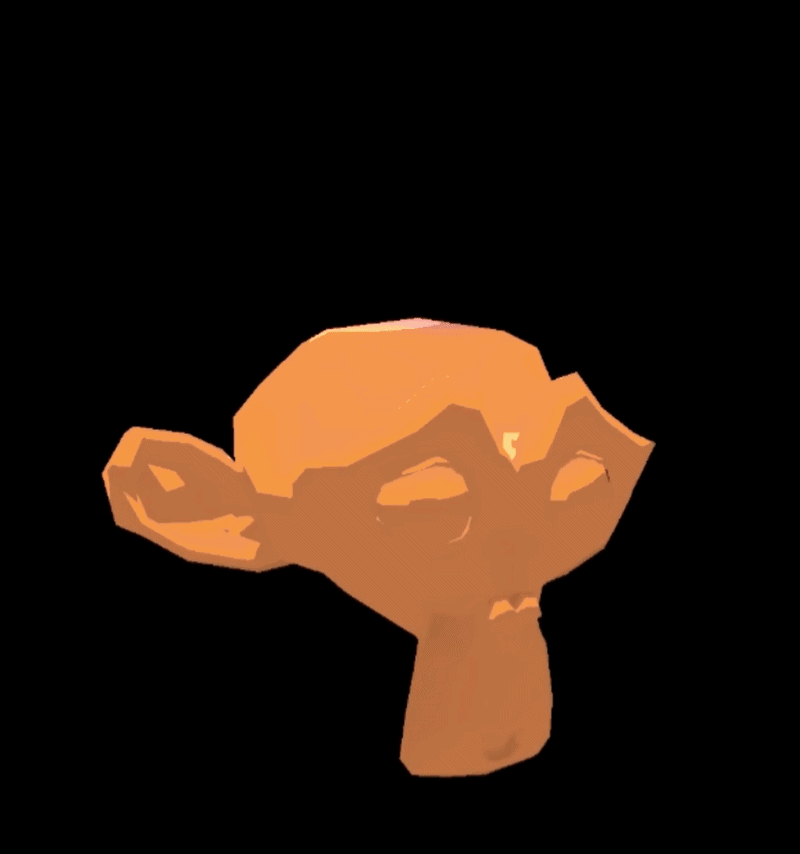
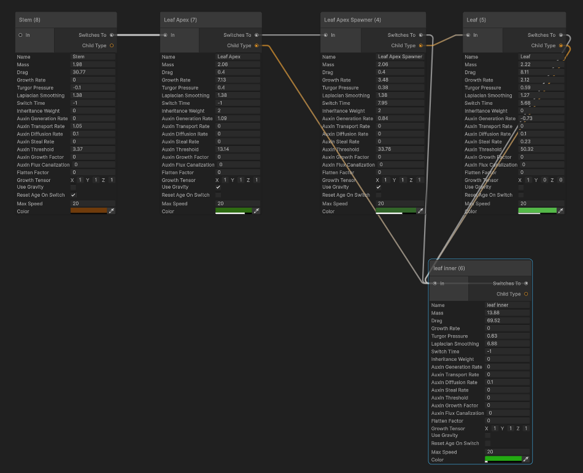
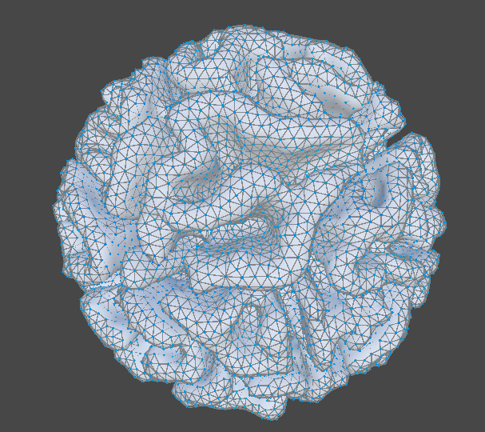
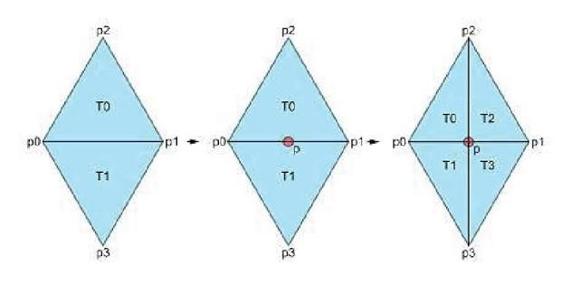
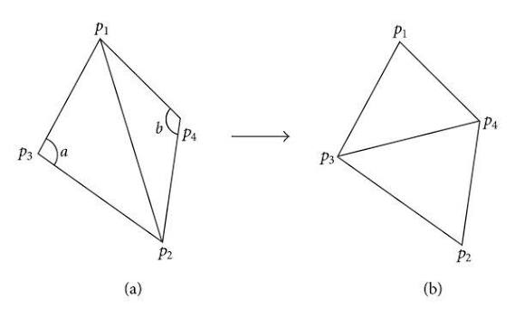
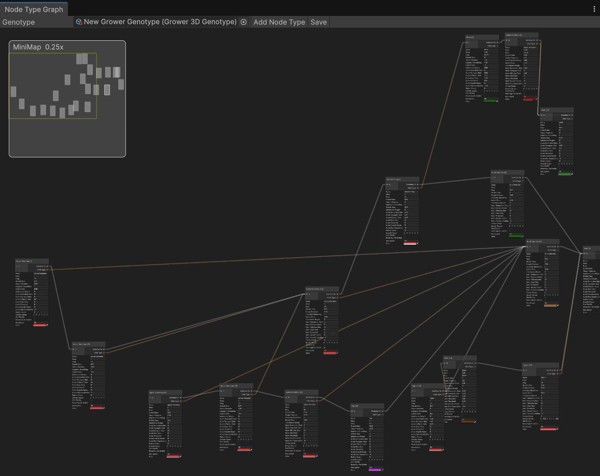

# Differential Growth with Cell Differentiation and Auxin Simulation

This project is a GPU-accelerated implementation of mesh-based differential growth. The research expands on existing implementations of 3D differential growth by introducing cell differentiation, where cells are able to change behavior and take on different cell types or produce children of different cell types. 

Cell differentiation mitigates several drawbacks of naive differential growth. For example, pure differential growth struggles with creating sharp shapes, asymmetrical stems, discretized regions, and customizability. But defining specific cell types can create these shapes quite easily, as well as allowing you to edit the growth beforehand by defining relationships between cell types. Additionally, by having cell types that give rise to different cell types, the model turns out to be a kind of L-system, and can produce interesting fractal-like growth structures.  

Furthermore, the research simulates the transfer of growth hormones in plants to drive certain behavior such as branching and growth rate. This yielded some interesting results , and further research may help shine light on existing biological growth models. 

Finally, the project improved on some existing 3D differential growth algorithms by utilizing several techniques to parallelize processes such as edge splitting, edge flipping, and self collisions. 

# What is differential growth?

Differential growth is a process where different parts of a structure grow at different rates. For example, the fringes of leaves growing faster and curving more than the leaf base, or areas of high surface area growing faster on coral, creating brain-like folds.

I used a mesh to represent the grower. The mesh implementation is covered in more detail below. 

Each vertex represents a "cell" and each edge acts as a spring between cells. The core algorithm relies on several basic forces, namely **separation, spring forces, and growth rate**. 

Cells experience a **separation** force between each other, if they are within a certain radius. 

Cells experience also experience **spring forces** governed by Hooke's law along their edges. This maintains shape.

**Growth rate** is the rate at which the edges expand. A cell grows by increasing the length of their edges. Several factors influence growth rate. When the edge reaches a certain length, the edge splits at its center and the cell creates a child. This child is a blend between its two parents. Cell types are covered in more detail below. 

Other forces included laplacian smoothing, gravity, turgor pressure, and growth tensors. For example, I stored up, right, and forward vectors for each cell that allowed them to orient themselves and grow anisotropically using a growth tensor. 

# Mesh System and Acceleration Structures

My system employs a half-edge mesh data structure, using compute shaders to resolve physics calculations as well as mesh maintenance. Since the system uses a half-edge mesh, it was easy to render the growers by generating meshes. 

### Spatial hashing

The core separation and attraction forces between cells is similar to particle-based fluid simulations. I used a spatial hash with grid sized by the radius of separation forces. The hash optimized the O(N^2) naive separation force calculation by only needing to check neighboring cells. 

### Edge Splitting

Edge splitting for a half-edge mesh involved inserting a vertex in the middle of an edge. However, to keep all faces triangles, you also need to reroute the top and bottom nodes and all the edge pointers of the local neighborhood.

Thus, doing edge splits on a compute shader was a challenge, since the half-edge mesh uses many pointers and several bugs can arrise in manipulating the same pointers in different threads on the GPU. 

To fix this, I used **Luby’s Algorithm for Maximal Independent Set**. It is a parellel greedy algorithm for finding a maximal independent set (MIS) in a graph, and runs quite quickly by assigning random weights to items in the graph, then finds local maxima to return an MIS. 
[https://www.cs.cmu.edu/afs/cs/academic/class/15750-s19/OldScribeNotes/lecture32.pdf](https://www.cs.cmu.edu/afs/cs/academic/class/15750-s19/OldScribeNotes/lecture32.pdf)

This algorithm came in very useful. An MIS has the nice property that no two vertices are connected by an edge (independent). 

My entire algorithm would be as so: 

1) Marks edges for operation (WANT TO SPLIT). These edges are all edges that are currently longer than the splitThreshold defined for that edge, and thus want to insert a node into itself. 

2) Run LUBY'S over *edges* to find all edges that are able to split (CAN SPLIT). This set of edges has no two adjacent/shared vertices between the edges, and thus can split without any pointer conflicts. 

3) Apply split to all edges that both CAN SPLIT and WANT TO SPLIT 

3) Loop again, running LUBY'S again over the new graph and splitting until all the edges that WANT TO SPLIT become split and there are no more pending edge splits.

### Edge Flipping

Delaunay flipping was used to keep mesh triangles well-shaped. Thissimilarly also involved pointers and required LUBY'S over edges to conduct non-conflicting flips. 

Delaunay flipping ensures there are no super thin triangles while growing. 

### Self collisions

The growth algorithm implements vertex-face self collisions and edge-edge self collisions, often found in cloth simulations. This is necessary as the grower often loops in on itself while expanding, and resolving self collisions ensured it would not become unrealistically entangled. 

# Auxin

An important part of plants is the auxin growth hormone, which drives many aspects in plant phyllotaxis. Auxin simultaneously helps determine where branches grow, how veins in cells form, and .  

Auxin simultaneously increases growth rate and inhibits growth rate. Different cells in plants have different sensitivies to auxin (for example, roots are very sensitive to auxin and high concentrations of it will stop root growth). An illustrative example of auxin's importance is that some weedkillers work by flooding plants with a synthetic form of auxin that rapidly promotes growth, killing the weed by causing uncontrolled cell division, and rapid, gnarled twisting. 

Although much more complex in the real world, my model simplifies the actual biological processes of auxin into a few key functionalities: cells are able to generate auxin, destroy auxin, diffuse auxin to nearby cells, steal auxin from neighbors, or actively transport auxin against the gradients. 

Cells are also able to define an auxin threshold, where, if they pass that threshold, they can switch into a different cell type. Cells additionally have an auxinGrowthFactor, that adds to their current growth rate based on how much auxin they have. 

### Canalization Hypothesis

Finally, the model implements the Canalization Hypothesis. The hypothesis is that plant hormone auxin moves through cells, and as auxin flows through a cell, it increases that cell’s capacity to transport auxin (its conductivity). This ends up carving channels: Higher auxin flux makes the cell better at moving more auxin. This creates a positive feedback loop, much like how flowing water gradually carves out a distinct riverbed or stream channel in the landscape.

I modeled this using by increasing conductivity of edges and using that conductivity to determine the diffusion of auxin. To customize, each cell type will have an Auxin Flux Canalization rate that determines how quickly its edges canalize to a conductivity of 1. 

### Example
The auxin system was useful in determining where branches would form in a growing stem. It would work like so: 

1) The apical meristem type would have a high growth rate and jut out. It would create stem children that have low growth rate and stay still. This forms a cylinder.

2) The apical meristem would generate a high amount of auxin that bleeds out to the stem.

3) The stem initially will work to actively transport auxin to nearby neighbors. This ends up creating hotspots (instead of passive diffusion). The hotspots end up in regions far away from each other.

4) When a hotspot hits a certain threshold, it becomes a branch cell that extends out.

Plants use these hotspots to make sure branches don't spawn right next to each other. In fact, this also helps create the golden ratio angles that appear between petals or leaves. 

# Cell Differentiation and Types

To create plant-like growth, this system uses cell types. These types are stored as a struct belonging to each cell. When an edge splits, the cells can create children that are different type than itself. Also, the cells can themselves switch into a different type based on certain criteria.

Below is a breakdown of what each cell type holds: 
- Name - the name of the cell
- Mass - how heavy it is, used for force calculation
- Growth Rate - a base speed that the cell's edges grow. The actual edge growth rate is averaged between both neighbors incident on the edge
- Turgor Pressure - a force that is applied on the normal of faces, expanding the mesh out
- Laplacian Smoothing - a force that draws nodes closer to the average of nearby nodes, making rounder objects
- Child Type - what type the cell will 
- Switch Type - what the cell will switch to 
- Switch Time - all cells store an AGE. The switch time is how long it takes before the cell will switch into a different cell. If switch time < 0, then this time is ignored and the cell type does not change based on its age.
- Auxin Generation Rate - constantly adds or removes auxin from this cell
- Auxin Transport Rate - forces auxin up the gradient, pushing it towards the neighbor that already has the most auxin
- Auxin Diffusion Rate - controls how fast auxin passively flows downhill to empty neighbors
- Auxin Steal Rate - pulls auxin directly out of neighboring nodes before they can route it themselves
- Auxin Growth Factor - how much auxin increased growth rate
- Auxin Flux Canalization - multiplier for how much flowing auxin increases an edge's conductivity
- Auxin Threshold - determines how much auxin to switch. If this is < 0, then type doesn't change based on auxin levels
- Flatten Factor - a force that flattens the cells
- Growth Tensor - a vector that is applied against the up, right, and forward of the node, and influences how forces on that node behaves directionally
- Use Gravity - bool to check if gravity is on for that cell
- Reset Age On Switch - if true, then when the cell switches type its age becomes 0
- Max Speed - the capped velocity of cell
- Color - the mesh color

A note is that cells don't simply create a child that is exactly the child type. This is because two neighbors may be different types. Thus, their child is a blend of its two parents. This blend is determined by inheritance weight and other factors.  

# Cell Type Editor 

Finally, to make many different growers, a graph editor in Unity was created to visualize and quickly create new growth genotypes. You can determine cell data and drag relationships between cell types, defining what children they create and what they switch to. 

# Acknowledgements, Resources, and References

Thank you to the resources used below. Also, thank you to my mentors Prof. Adam Mally, and Jessica Kimpel. Also, thank you very much to the University of Pennsylvania Diane Chi Fund for the great research opportunity.

### Biology

Hormones and shape creation

[The ABC model of floral development - ScienceDirect](https://www.sciencedirect.com/science/article/pii/S0960982217303433)

[Q&A: Auxin: the plant molecule that influences almost anything - PMC](https://pmc.ncbi.nlm.nih.gov/articles/PMC4980777/) -> explains how auxin works

[Beyond the Divide: Boundaries for Patterning and Stem Cell Regulation in Plants](https://www.frontiersin.org/journals/plant-science/articles/10.3389/fpls.2015.01052/full) -> boundary cells

Golden Ratio

[L-systems: from the Theory to Visual Models of Plants | AlgorithmicBotany](https://algorithmicbotany.org/papers/sigcourse.2003/2-1-lsystems.pdf)

[Golden Angle | AlgorithmicBotany](https://algorithmicbotany.org/papers/GoldenAngle2026.html) -> indicating how asymmetrical L systems can be used to generate golden ratios

[The Mathematical Lives of Plants | ScienceNews](https://www.sciencenews.org/article/mathematical-lives-plants) -> indicating how auxin and competing for free space generates golden ratios

Misc.

[Growth, geometry, and mechanics of a blooming lily | PNAS](https://www.pnas.org/doi/10.1073/pnas.1007808108)

[The Chemical Basis of Morphogenesis A. M. Turing Philosophical Transactions of the Royal Society of London. Series B, Biological](https://www.dna.caltech.edu/courses/cs191/paperscs191/turing.pdf) -> Turing’s paper on Turing Patterns

[18.03SCF11 text: Under, Over and Critical Damping](https://ocw.mit.edu/courses/18-03sc-differential-equations-fall-2011/7e212064ad281d00e1dac893b1f722a7_MIT18_03SCF11_s13_2text.pdf)

## Algorithms and other helpful items

Edge splitting and flipping

[Half-edge data structure](https://cs418.cs.illinois.edu/website/text/halfedge.html)

[Visualizing Delaunay Triangulation](https://ianthehenry.com/posts/delaunay/)

[Lecture 32: Luby's Algorithm for Maximal Independent Set](https://www.cs.cmu.edu/afs/cs/academic/class/15750-s19/OldScribeNotes/lecture32.pdf) -> used for edge splitting and flipping

## Collision and SPH

[Real-Time Collision Detection](http://www.r-5.org/files/books/computers/algo-list/realtime-3d/Christer_Ericson-Real-Time_Collision_Detection-EN.pdf) -> book used for vertex-face and edge-edge collision detection

[Collision and self-collision handling in cloth model dedicated to design garments](https://graphics.stanford.edu/courses/cs468-02-winter/Papers/Collisions_vetements.pdf)

[Particle-Based Fluid Simulation for Interactive Applications](https://matthias-research.github.io/pages/publications/sca03.pdf)

[Smoothed Particle Hydrodynamics Techniques for the Physics Based Simulation of Fluids and Solids](https://sph-tutorial.physics-simulation.org/pdf/SPH_Tutorial.pdf)

[Parallel Algorithms: Bitonic Mergesort](https://virtuolo.medium.com/parallel-algorithms-bitonic-mergesort-d0d6be8a0a93)

[Simulating Fluids - Sebastian Lague](https://www.youtube.com/watch?v=rSKMYc1CQHE)

## Lockhart Equation and supporting math

[Mechanical Models of Plant Growth | SIAM](https://www.siam.org/publications/siam-news/articles/mechanical-models-of-plant-growth/) -> what is the lockhart equation? Also explains how plant growth is like moving through a viscous fluid

[Solutions for a local equation of anisotropic plant cell growth: an analytical study of expansin activity - PMC](https://pmc.ncbi.nlm.nih.gov/articles/PMC3104332/)

## Existing Implementations of Differential Growth

[Floraform – an exploration of differential growth – Nervous System blog](https://n-e-r-v-o-u-s.com/blog/?p=6721)

[Inconvergent | Differential Mesh](https://inconvergent.net/generative/differential-mesh/)

[Interactive differential growth simulation for design](https://em-yu.github.io/media/papers/interactive-diff-growth.pdf) -> example implementation

[Differential growth and shape formation of a flower-shaped structure - ScienceDirect](https://www.sciencedirect.com/science/article/pii/S002074622400283X)

[Differential Growth in Nature and Design - designcoding](https://www.designcoding.net/differential-growth/)